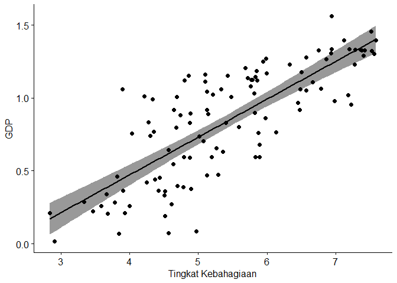
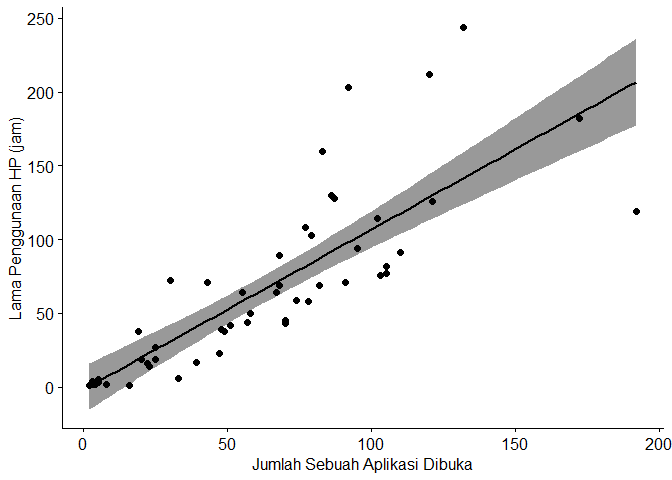
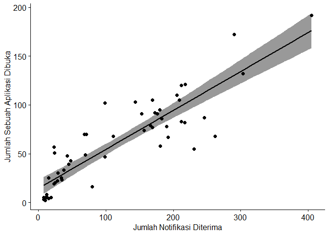
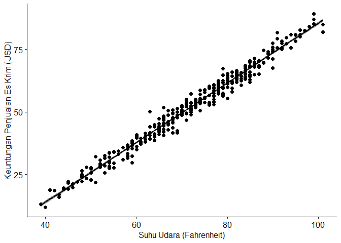

Correlation Analysis
================

## Mengaktifkan beberapa Package yang akan digunakan

``` r
library(readxl)   #Package yang berguna untuk membaca file dalam format excel
library(ggplot2)  #Package yang berguna untuk membuat tabel
library(ggpubr)
library(plotly)
```

    ## 
    ## Attaching package: 'plotly'

    ## The following object is masked from 'package:ggplot2':
    ## 
    ##     last_plot

    ## The following object is masked from 'package:stats':
    ## 
    ##     filter

    ## The following object is masked from 'package:graphics':
    ## 
    ##     layout

``` r
library(knitr)    
library(rmarkdown)
```

## Membaca data yang sudah disimpan dalam format Excel (.xls atau .xlsx)

``` r
data_inc_hap <- read_excel("Data - Income and Happiness Correlation.xlsx") #Data tentang GDP dan Tingkat Kebahagiaan pada 111 negara di dunia

data_screentime <- read_excel("Screentime - App.xlsx") #Data tentang jumlah notifikasi yang diterima dan jumlah membuka hp dalam suatu waktu

data_ice_temp <- read_excel("Ice Cream Sales - Temperatures.xlsx") # Data tentang suhu udara di suatu tempat dan keuntungan penjualan es krim
```

Syntax `read_excel` mengasumsikan bahwa file excel yang akan dibaca
berada pada **Working Directory RStudio**, dimana dalam kasus ini
Working Directory saya berada pada path “C:/Users/Rama/Documents”

Jika ingin mengetahui letak Working Directory bisa menggunakan syntax
**“getwd()”** <br><br>

## Melihat data yang sudah diaktifkan

Menampilkan 10 data pertama pada data GDP dan Tingkat Kebahagiaan dalam
bentuk tabel

``` r
kable(head(data_inc_hap,10))
```

| country      | adjusted_satisfaction | avg_satisfaction | std_satisfaction | avg_income | median_income | income_inequality | region                        | happyScore |     GDP |
|:-------------|----------------------:|-----------------:|-----------------:|-----------:|--------------:|------------------:|:------------------------------|-----------:|--------:|
| Armenia      |                    37 |              4.9 |             2.42 |    2096.76 |      1731.507 |          31.44556 | ‘Central and Eastern Europe’  |      4.350 | 0.76821 |
| Angola       |                    26 |              4.3 |             3.19 |    1448.88 |      1044.240 |          42.72000 | ‘Sub-Saharan Africa’          |      4.033 | 0.75778 |
| Argentina    |                    60 |              7.1 |             1.91 |    7101.12 |      5109.400 |          45.47556 | ‘Latin America and Caribbean’ |      6.574 | 1.05351 |
| Austria      |                    59 |              7.2 |             2.11 |   19457.04 |     16879.620 |          30.29625 | ‘Western Europe’              |      7.200 | 1.33723 |
| Australia    |                    65 |              7.6 |             1.80 |   19917.00 |     15846.060 |          35.28500 | ‘Australia and New Zealand’   |      7.284 | 1.33358 |
| Azerbaijan   |                    46 |              5.8 |             2.27 |    3381.60 |      2931.480 |          24.21500 | ‘Central and Eastern Europe’  |      5.212 | 1.02389 |
| Bangladesh   |                    43 |              5.3 |             2.10 |    1265.34 |       994.140 |          32.66500 | ‘Southern Asia’               |      4.694 | 0.39753 |
| Belgium      |                    63 |              7.2 |             1.72 |   17168.51 |     15166.455 |          28.74500 | ‘Western Europe’              |      6.937 | 1.30782 |
| Burkina Faso |                    37 |              4.4 |             2.02 |     870.84 |       630.240 |          39.76000 | ‘Sub-Saharan Africa’          |      3.587 | 0.25812 |
| Bulgaria     |                    34 |              4.6 |             2.57 |    5354.82 |      4523.565 |          34.16250 | ‘Central and Eastern Europe’  |      4.218 | 1.01216 |

<br> Menampilkan 5 data pertama pada data jumlah notifikasi dan jumlah
menggunakan hp dalam bentuk tabel

``` r
kable(head(data_screentime,5), col.names = list("Tanggal", "Lama Penggunaan HP (jam)", "Jumlah Notifikasi Diterima", "Jumlah Sebuah Aplikasi Dibuka", "Nama Aplikasi"))
```

| Tanggal    | Lama Penggunaan HP (jam) | Jumlah Notifikasi Diterima | Jumlah Sebuah Aplikasi Dibuka | Nama Aplikasi |
|:-----------|-------------------------:|---------------------------:|------------------------------:|:--------------|
| 08/26/2022 |                       38 |                         70 |                            49 | Instagram     |
| 08/27/2022 |                       39 |                         43 |                            48 | Instagram     |
| 08/28/2022 |                       64 |                        231 |                            55 | Instagram     |
| 08/29/2022 |                       14 |                         35 |                            23 | Instagram     |
| 08/30/2022 |                        3 |                         19 |                             5 | Instagram     |

<br> Menampilkan 5 data pertama pada data suhu udara dan keutungan
penjualan es krim dalam bentuk tabel

``` r
kable(head(data_ice_temp,5), col.names = list("Suhu Udara (dalam Fahrenheit)","Keuntungan Penjualan (dalam USD$)"))
```

| Suhu Udara (dalam Fahrenheit) | Keuntungan Penjualan (dalam USD\$) |
|------------------------------:|-----------------------------------:|
|                            39 |                              13.17 |
|                            40 |                              11.88 |
|                            41 |                              18.82 |
|                            42 |                              18.65 |
|                            43 |                              17.02 |

<br><br>

## Analisis Korelasi Antara GDP dan Tingkat Kebahagiaan

**VISUALISASI DENGAN SCATTERPLOT**

``` r
ggscatter(data_inc_hap, x = "happyScore", y="GDP", add = "reg.line", cor.method = "pearson", conf.int = TRUE, xlab = "Tingkat Kebahagiaan", ylab = "GDP")
```

<!-- -->

**PENJELASAN PLOT** Berdasarkan plot diatas, korelasi antara GDP dan
Tingkat Kebahagiaan cenderung mengarah ke kanan atas. Hasil tersebut
memberikan arti bahwa **GDP dan Tingkat Kebahagiaan memiliki korelasi
positif**, artinya apabila GDP meingkat, maka Tingkat Kebahagiaan akan
meningkat pula. Begitu pula sebaliknya, apabila GDP menurun, maka
Tingkat Kebahagiaan akan menurun pula. <br>

**ANALISIS KORELASI DENGAN METODE KORELASI PEARSON**

``` r
test_inc_hap <- cor.test(data_inc_hap$happyScore, data_inc_hap$GDP, method = "pearson")
test_inc_hap
```

    ## 
    ##  Pearson's product-moment correlation
    ## 
    ## data:  data_inc_hap$happyScore and data_inc_hap$GDP
    ## t = 13.455, df = 109, p-value < 2.2e-16
    ## alternative hypothesis: true correlation is not equal to 0
    ## 95 percent confidence interval:
    ##  0.7079171 0.8511169
    ## sample estimates:
    ##       cor 
    ## 0.7900609

**KEPUTUSAN DAN KESIMPULAN**<br> Berdasarkan **hasil** diatas, diperoleh
koefisien korelasi pearson sebesar **0.7079171** dan *p-value* sebesar
**2.2e-16** sehingga kesimpulannya adalah **GDP dan Tingkat Kebahagiaan
berkorelasi secara positif dan signifikan**. <br><br>

## Analisis Korelasi Antara Lama Penggunaan HP, Jumlah Notifikasi Diterima, dan Jumlah Sebuah Aplikasi Dibuka

**VISUALISASI DENGAN SCATTERPLOT ANTARA JUMLAH SEBUAH APLIKASI DIBUKA
DAN LAMA PENGGUNAAN HP**

``` r
ggscatter(data_screentime, x = "Times opened", y = "Usage", add = "reg.line", cor.method = "pearson", conf.int = TRUE, xlab = "Jumlah Sebuah Aplikasi Dibuka", ylab = "Lama Penggunaan HP (jam)")
```

<!-- -->

**PENJELASAN PLOT** Berdasarkan plot diatas, korelasi antara Jumlah
Sebuah Aplikasi Dibuka dan Lama Penggunaan HP cenderung mengarah ke
kanan atas. Hasil tersebut memberikan arti bahwa **Jumlah Sebuah
Aplikasi Dibuka dan Lama Penggunaan HP memiliki korelasi positif**,
artinya apabila Jumlah Sebuah Aplikasi Dibuka meingkat, maka Lama
Penggunaan HP akan meningkat pula, begitu pula sebaliknya. <br><br>

**ANALISIS KORELASI ANTARA JUMLAH SEBUAH APLIKASI DIBUKA DAN LAMA
PENGGUNAAN HP DENGAN METODE KORELASI PEARSON**

``` r
test_screentime_1 <- cor.test(data_screentime$`Times opened`, data_screentime$Usage, method = "pearson")
test_screentime_1
```

    ## 
    ##  Pearson's product-moment correlation
    ## 
    ## data:  data_screentime$`Times opened` and data_screentime$Usage
    ## t = 10.195, df = 52, p-value = 5.317e-14
    ## alternative hypothesis: true correlation is not equal to 0
    ## 95 percent confidence interval:
    ##  0.7021372 0.8896830
    ## sample estimates:
    ##      cor 
    ## 0.816409

**KEPUTUSAN DAN KESIMPULAN**<br> Berdasarkan **hasil** diatas, diperoleh
koefisien korelasi pearson sebesar **0.816409** dan *p-value* sebesar
**5.317e-14** sehingga kesimpulannya adalah **GDP dan Tingkat
Kebahagiaan berkorelasi secara positif dan signifikan**. <br><br>

**VISUALISASI DENGAN SCATTERPLOT ANTARA JUMLAH NOTIFIKASI DITERIMA DAN
JUMLAH SEBUAH APLIKASI DIBUKA**

``` r
ggscatter(data_screentime, x = "Notifications", y = "Times opened", add = "reg.line", cor.method = "spearman", conf.int = TRUE, xlab = "Jumlah Notifikasi Diterima", ylab = "Jumlah Sebuah Aplikasi Dibuka")
```

<!-- -->

**PENJELASAN PLOT** Berdasarkan plot diatas, korelasi antara Jumlah
Notifikasi Diterima dan Jumlah Sebuah Aplikasi Dibuka cenderung mengarah
ke kanan atas. Hasil tersebut memberikan arti bahwa **Jumlah Notifikasi
Diterima dan Jumlah Sebuah Aplikasi Dibuka memiliki korelasi positif**,
artinya apabila Jumlah Notifikasi Diterima meingkat, maka Jumlah Sebuah
Aplikasi Dibuka akan meningkat pula, begitu pula sebaliknya. <br><br>

**ANALISIS KORELASI ANTARA JUMLAH NOTIFIKASI DITERIMA DAN JUMLAH SEBUAH
APLIKASI DIBUKA DENGAN METODE KORELASI SPEARMAN**

``` r
test_screentime_2 <- cor.test(data_screentime$Notifications, data_screentime$`Times opened`, method = "spearman")
```

    ## Warning in cor.test.default(data_screentime$Notifications,
    ## data_screentime$`Times opened`, : Cannot compute exact p-value with ties

``` r
test_screentime_2
```

    ## 
    ##  Spearman's rank correlation rho
    ## 
    ## data:  data_screentime$Notifications and data_screentime$`Times opened`
    ## S = 3623.5, p-value < 2.2e-16
    ## alternative hypothesis: true rho is not equal to 0
    ## sample estimates:
    ##       rho 
    ## 0.8618823

**KEPUTUSAN DAN KESIMPULAN**<br> Berdasarkan **hasil** diatas, diperoleh
koefisien korelasi spearman sebesar **0.8618823** dan *p-value* sebesar
**2.2e-16** sehingga kesimpulannya adalah **Jumlah Notifikasi Diterima
dan Jumlah Sebuah Aplikasi Dibuka berkorelasi secara positif dan
signifikan**. <br><br>

## Analisis Korelasi Antara Suhu Udara dan Keuntungan Penjualan Es Krim

**VISUALISASI DENGAN SCATTERPLOT**

``` r
ggscatter(data_ice_temp, x = "Temperature", y = "Ice Cream Profits", add = "reg.line", cor.method = "kendall", conf.int = TRUE, xlab = "Suhu Udara (Fahrenheit)", ylab = "Keuntungan Penjualan Es Krim (USD)")
```

<!-- -->

**PENJELASAN PLOT** Berdasarkan plot diatas, korelasi antara Suhu Udara
dan Keuntungan Penjualan Es Krim cenderung mengarah ke kanan atas. Hasil
tersebut memberikan arti bahwa **Suhu Udara dan Keuntungan Penjualan Es
Krim memiliki korelasi positif**, artinya apabila Suhu Udara meingkat,
maka Keuntungan Penjualan Es Krim akan meningkat pula, begitu pula
sebaliknya. <br><br>

**ANALISIS KORELASI ANTARA SUHU UDARA DAN KEUNTUNGAN PENJUALAN ES KRIM
DENGAN METODE KORELASI KENDALL**

``` r
test_screentime_3 <- cor.test(data_ice_temp$Temperature, data_ice_temp$`Ice Cream Profits`, method = "kendall")
test_screentime_3
```

    ## 
    ##  Kendall's rank correlation tau
    ## 
    ## data:  data_ice_temp$Temperature and data_ice_temp$`Ice Cream Profits`
    ## z = 25.789, p-value < 2.2e-16
    ## alternative hypothesis: true tau is not equal to 0
    ## sample estimates:
    ##       tau 
    ## 0.9133351

**KEPUTUSAN DAN KESIMPULAN**<br> Berdasarkan **hasil** diatas, diperoleh
koefisien korelasi kendall sebesar **0.9133351** dan *p-value* sebesar
**2.2e-16** sehingga kesimpulannya adalah **Suhu Udara dan Keuntungan
Penjualan Es Krim berkorelasi secara positif dan signifikan**. <br><br>
